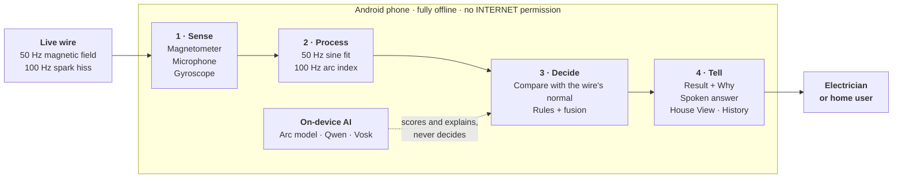
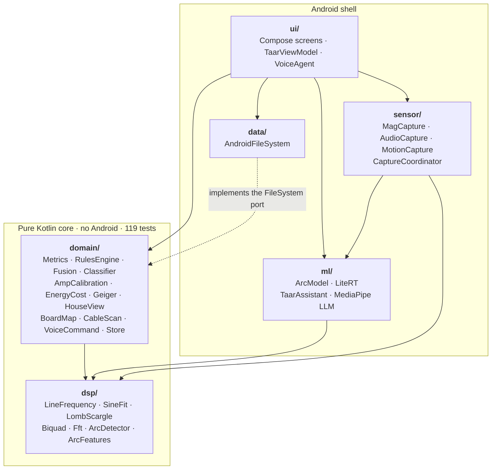
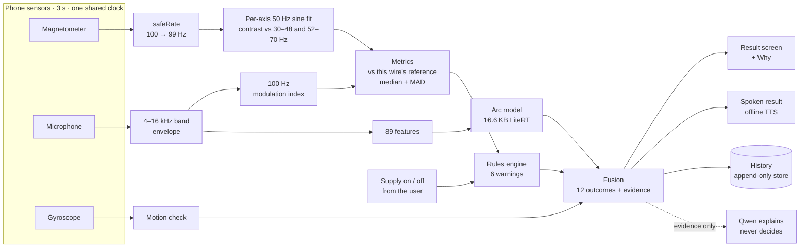
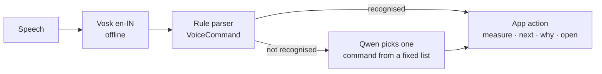

# Taar - Your phone can see electricity

**Hold your phone on a wire for three seconds. Taar tells you whether current is
flowing, roughly how much, and whether anything is sparking. It never touches the
wire, and it never touches the internet.**

- **Magnetometer → current.** The compass sensor feels the 50 Hz magnetic field of a live wire.
- **Microphone → sparking.** A loose, arcing joint hisses in a rhythm locked to the mains.
- **Three AI models, all on the phone.** No server, no account, no `INTERNET` permission.

Built for **iQOO City Battles 2026, Hyderabad** (26–27 September), Track 05: Smart Living.
*Taar* (తార) means "wire" in Telugu.

---

## At a glance



---

## Contents

1. [The problem](#the-problem)
2. [Who it is for](#who-it-is-for)
3. [How it works: the physics](#how-it-works-the-physics)
4. [Measured on hardware](#measured-on-hardware)
5. [Using the app](#using-the-app)
6. [The result screen](#the-result-screen)
7. [Every feature](#every-feature)
8. [On-device AI](#on-device-ai)
9. [Offline by construction](#offline-by-construction)
10. [Tech stack](#tech-stack)
11. [Architecture](#architecture)
12. [Build and run](#build-and-run)
13. [Tests](#tests)
14. [What hardware taught us](#what-hardware-taught-us)
15. [What Taar does not do](#what-taar-does-not-do)
16. [Roadmap](#roadmap)
17. [Repository layout](#repository-layout)
18. [Credits](#credits)

---

## The problem

Electrical faults start fires, and the faults that start them are invisible:

- **A loose connection, quietly arcing.** A terminal behind a switchboard cover
  sparks a hundred times a second. It heats, chars and one day ignites.
- **A circuit run over its rating.** An AC and a geyser added to a wire sized for
  lights. The breaker holds, the insulation slowly cooks, the bill goes up.
- **A breaker labelled "off" that is live.** The label may be ten years out of date,
  and the electrician is about to touch the wire.

The instruments that catch these (a clamp meter, a thermal camera, an arc-fault
analyser) cost more than a small electrician earns in a month. So the homes and
small shops that most need checking never get checked.

## Who it is for

| The electrician | Anyone at home |
|---|---|
| Confirm a switched-off circuit really carries no current before touching it | "Is this wire live?" Geiger mode clicks faster near current, with no setup |
| Find which breaker feeds which wire | "What does this appliance cost me?" Amps and rupees a month after one calibration |
| Narrow down where a cable is sparking | "Is something sparking behind the switchboard?" |
| Record each circuit's normal once, compare on every visit | "Which room is drawing power?" House View lights each room by its current |
| Hear the result spoken while the phone faces the wall | Ask in plain English: "why did it say that?" |

Both are told the same thing on every screen: **Taar is a triage aid, not a
certificate. It senses current, not voltage.**

---

## How it works: the physics

### 1. Current: measure the 50 Hz in the field, not the field

A wire carrying current makes a magnetic field, `B = μ₀I / 2πr`. A 5 A load at 3 cm
from a single conductor gives about 33 µT, comparable to Earth's own ~45 µT and well
above the 0.4 µT sensor noise floor. **Strength was never the problem. Telling it
apart is.** Earth's field is static, a hand drifts several µT and trembles at about
10 Hz, and chargers and metal all move the needle.

So Taar fits a 50 Hz sine to **each axis separately** and compares its power with
the neighbouring bands (30–48 Hz and 52–70 Hz). That ratio is the **contrast**:

| Contrast | Verdict |
|---|---|
| under 8× | no current |
| 8× to 13.5× | unclear, measure again |
| over 13.5× | current flowing |

### 2. The sampling trap that would have killed the project

Android's default sensor rate is **100 Hz, and at 100 Hz a phone cannot measure
50 Hz properly.** The danger is not a slow sensor. What matters is how many
distinct points of the 50 Hz wave the samples land on:

```
phases = fs / gcd(fs, 50)        fitting sin + cos needs at least 3
```

| Sample rate | Distinct phases | Result |
|---|---|---|
| 24 Hz | 12 | amplitude recovered to 0.3% |
| 50 Hz | 1 | wave looks flat, fails completely |
| 100 Hz (Android default) | 2 | 22% error |
| 99 Hz | 99 | fine |

The rates below 150 Hz that fail are **10, 20, 25, 50 and 100**. The fix is one call
at sensor registration: `LineFrequency.safeRate()` moves 100 → 99. The iQOO
delivered **105.3 Hz over 21 phases**. Taar measures the real rate in its phone check
and refuses to measure on a sensor it has not checked.

### 3. Sparking: an arc has a heartbeat

A series arc re-ignites twice every mains cycle, so its hiss pulses at **100 Hz**.
Taar records 3 s of audio, keeps only the 4–16 kHz band where arc noise lives, takes
the envelope, and asks how much of it pulses at 100 Hz compared with 20–400 Hz.
Loudness cancels out, so one threshold works in a quiet cupboard and a plant room.

| False alarms on | Loudness detector | 100 Hz detector |
|---|---|---|
| Ballast hum | 100% | 4% |
| Speech | 100% | 6% |
| Keys, sleeve rustle | 100% | 10% |
| Motor | 100% | 5% |

**The same lesson, found twice: don't measure energy, measure energy locked to the grid.**

---

## Measured on hardware

Thirteen captures on the iQOO, phone lying still on a 1200 W kettle's supply cord
(≈5.2 A):

| State | Contrast at 50 Hz |
|---|---|
| No current (8 captures) | 3× · 1× · 6× · 3× · 0× · 4× · 5× · 7× |
| Kettle boiling (5 captures) | **28× · 37× · 43× · 58× · 62×** |

A separation factor of four, with no overlap.

| Measurement | Value |
|---|---|
| Magnetometer rate on the iQOO | 105.3 Hz, 21 distinct phases |
| Noise floor, two sessions | 0.39–0.40 µT RMS |
| Earlier fridge test | 9× and 16× running, 2–3× idle |
| Field on a two-core cord | ≈0.048 µT per amp (live and neutral cancel all but ~1/200th) |

Every threshold in the app comes from these numbers, not from simulation. Full
record and caveats: [`docs/PREFLIGHT.md`](docs/PREFLIGHT.md) §3.

---

## Using the app

Set up once, then three seconds per wire.

| Step | When | What happens |
|---|---|---|
| **1. Phone check** | once | 3 s flat on a table. Measures the real sensor rate, picks a safe one, reads the noise floor, checks the mic. |
| **2. Name the circuits** | once per board | One board and its breakers. Enter the rating printed on each (e.g. `B16`) so Taar can warn near the limit. |
| **3. Record its normal** | once per wire | 3 captures with the wire in its everyday state. Every later reading is compared with this. |
| **4. Measure** | every time | Say whether the supply is on or off, press the phone flat on the cable, hold still for 3 s. One result, spoken aloud. |

### "Is this circuit's supply on?"

The phone senses current, not voltage, so it can't tell a switched-off breaker from
an appliance that simply isn't running. You tell it:

- **On (normal use).** Taar reports whether current is flowing and flags anything unusual.
- **Off (I switched the breaker off).** Taar checks that the wire is really dead:
  - no current → "a good sign, but not proof"; still use a voltage tester before touching
  - current → **red warning: stop.** The breaker is probably mislabelled, or there is a back-feed.
  - unclear → measure again; don't assume it's off

---

## The result screen

**Explainable sensor fusion.** One answer, every signal behind it. It says what was
observed, never "safe".

| Signal | What it contributes |
|---|---|
| Magnetometer | 3 s at a safe rate, per-axis 50 Hz sine fit, contrast against neighbouring bands |
| Microphone | 4–16 kHz envelope, 100 Hz modulation index, 89 features for the arc model |
| Gyroscope | Did the phone turn during the capture? Then the reading is unreliable, not interpreted |
| Reference and rules | Median and MAD against this wire's own normal; six warnings |
| Fusion | 12 named outcomes; evidence strength counts the signals that agree and shows where they disagree |

### The six warnings, each ending in an action

1. **Current on a circuit you switched off.** Stop: mislabelled breaker or back-feed. Do not work on it.
2. **Possible arcing / loose connection.** Isolate and have the terminations checked.
3. **Load at or above breaker rating.** Move load or have the circuit uprated.
4. **Load higher than usual.** Expected if you just switched something on; if not, check what was added.
5. **Can't confirm the switched-off circuit.** Keep still and measure again. Do not assume.
6. **Reading not usable.** Re-run the phone check and capture again.

### Three rules that never bend

- **Refuse rather than guess.** No reference, an unclear signal or a moved phone
  gives a refusal, not a plausible number.
- **A warning fires only when every condition holds.** A partial match is a
  different situation, not a weak diagnosis.
- **Amperes only when calibrated.** Otherwise a relative index. A made-up ampere
  figure is worse than none.

Tap **Why** on any result and every signal is listed as *supports*, *against*,
*neutral* or *unavailable*, so a technician can disagree with the tool on site.

---

## Every feature

| Feature | What it does |
|---|---|
| **Measure** | 3 s on the cable → one fused, spoken result |
| **Reference** | Each wire's own normal, from 3 captures |
| **Amps calibration** | One known appliance (e.g. a kettle, off then on) turns the index into amperes for that circuit |
| **Cost in rupees** | What the wire costs a month, at the TSSPDCL domestic rate (₹7.70/unit by default, adjustable), with hours per day per circuit |
| **Geiger mode** | Clicks faster near a live wire: 1.5 → 25 clicks/s as contrast rises from 5× to 30×, 8 updates a second. No setup |
| **House View** | Circuits drawn as rooms, each lit by the current last measured on it. Drag to turn, tilt, zoom. Unmeasured rooms stay dark |
| **Board Map** | A photo of the board with a coloured dot per breaker showing its latest result |
| **Cable Scan** | Where along a cable the sparking signal is strongest |
| **Live view** | Signal to result, every 3 s, showing what Taar sees |
| **Spoken results** | Every result read aloud by the phone's offline voice, after the capture |
| **Voice control** | "Measure kitchen", "next", "why?", "how much does the AC cost", "house view". Offline |
| **Ask Taar** | The on-device assistant explains any result or answers questions about the app |
| **Teach Taar** | Label a reading Normal / Warning / Fault; recognised from the next reading on |
| **Motion check** | The gyroscope marks a moved capture unreliable |
| **History** | Every reading kept on the phone, append-only |

Geiger mode and Board Map are extra modes, switched on from **Tools**.

---

## On-device AI

**The AI explains. The physics decides.** Zero bytes are uploaded.

### Arc model: LiteRT (TensorFlow Lite), 16.6 KB

- An MLP over 89 sound features, about 3,400 weights.
- Trained on **1,157 captures recorded on the iQOO itself**: simulated arcs played
  through a speaker, and real not-arcs from real rooms. Held out by session, never by clip.
- False alarms: **10.2% with the rule alone → 0.6% with the model.** Detection: **94.8%**.
- Self-checks against golden rows (tolerance 1e-4) at every launch.

### Assistant: Qwen2.5-0.5B-Instruct (int8) via MediaPipe LLM Inference

- About 550 MB, running on the phone's CPU. Temperature 0.3.
- Under every result it explains that reading from Taar's own evidence.
- In the **Ask AI** tab it answers questions about the app from 22 built-in notes,
  chosen by keyword overlap and shown under the answer.
- Guardrails: forbidden by its prompt to invent numbers; flagged by a regex if it
  calls a wire safe; **never decides a result.**

### Voice: Vosk en-IN, offline speech, rules first

- Indian-English speech recognition on the phone.
- A rule parser handles the commands. Anything it doesn't recognise goes to Qwen,
  which can only pick one command from a fixed list, never invent one.
- Conversation mode listens again after each reply and pauses while the microphone records.
- Never by voice: marking a supply as off, or deleting anything.

### A fourth learner with no training run

A **nearest-centroid classifier** fed by the technician's own labels. Mark a reading
on Tuesday and it is recognised on Wednesday. It rejects the unfamiliar rather than
picking the nearest wrong answer, and it sits **behind** the rules, never in front.

---

## Offline by construction

```xml
<!-- AndroidManifest.xml -->
<uses-permission android:name="android.permission.RECORD_AUDIO" />
<uses-permission android:name="android.permission.VIBRATE" />
<!-- android.permission.INTERNET: absent. Nothing to upload. -->
```

Boards live in basements with no signal, a building's circuit map is a security
document, and a measurement can't have a network round trip inside it. Every
capture, model and answer stays on the phone. Anyone can verify this in the manifest.

---

## Tech stack

| Piece | What we used |
|---|---|
| Language, UI | Kotlin, Jetpack Compose, Material 3, coroutines |
| Android | minSdk 26, targetSdk 35, arm64-v8a, Gradle 9.7.1 |
| Arc model runtime | Google LiteRT 1.4.2 (TensorFlow Lite) |
| Language model | MediaPipe `tasks-genai` 0.10.35, Qwen2.5-0.5B-Instruct q8 |
| Speech | Vosk 0.3.47 with the small en-IN model, Android TextToSpeech |
| Research spikes | Python, NumPy, SciPy, TensorFlow (training only) |
| Testing | Golden vectors from the Python spikes, run by JUnit and by `verify.sh` with no SDK |
| APK | about 24 MB, arm64 |

---

## Architecture

The app follows a clean, layered architecture. The physics and the decisions live in
a **pure Kotlin core with no Android dependency**, so all 119 logic checks run on a
laptop without a phone or the Android SDK. Android-specific code sits around that
core and depends on it, never the other way round.

### Layers and dependencies



| Rule | Why |
|---|---|
| `dsp/` depends on nothing | The signal maths is checked against golden vectors from the Python spikes, to 1e-9 |
| `domain/` depends only on `dsp/` | Rules, fusion and calibration are testable without a phone |
| `data/` implements a port defined in `domain/` | `Store` is written against a `FileSystem` interface; Android storage is plugged in from outside (dependency inversion) |
| `ml/` only explains or scores; it never decides | The arc model is one input to fusion, and the language model only explains a finished result |
| `ui/` is the only place everything meets | `TaarViewModel` wires sensors, models, storage and domain logic together |

### One measurement, end to end



### Voice command flow



### Packages (`spike/android/app/src/main/java/com/taar/`)

| Package | Contents |
|---|---|
| `sensor/` | `MagCapture`, `MagStream`, `AudioCapture`, `MotionCapture`, `CaptureCoordinator` on one shared clock, with per-sample timestamps |
| `dsp/` | `LineFrequency` (rate guard), `SineFit`, `LombScargle`, `Biquad`, `Fft`, `ArcDetector`, `ArcFeatures`, `Spectrogram`. Pure Kotlin, no Android |
| `domain/` | `Stats`, `Thresholds`, `Metrics`, `FaultCatalogue`, `Fusion`, `Classifier`, `AmpCalibration`, `EnergyCost`, `Geiger`, `BoardMap`, `HouseView`, `CableScan`, `MotionCheck`, `VoiceCommand`, `SpokenResult`, `AssistantPrompt`, `ProductKnowledge`, `Store`. Pure Kotlin |
| `ml/` | `ArcModel` (LiteRT interpreter + self-check), `TaarAssistant` (MediaPipe LLM) |
| `ui/` | Jetpack Compose. Four tabs: Home, Tools, Ask AI, History. Every task screen is full-screen |
| `data/` | Append-only, atomic, versioned line store. A capture is the one thing that can't be retaken |

---

## Build and run

### Requirements

- JDK 17 or newer (verified on JDK 27; Android Studio's bundled JDK also works)
- Android SDK (API 35), or Android Studio
- An arm64 Android phone **with a magnetometer**, Android 8.0 (API 26) or newer

### 1. Fetch the offline speech model (54 MB, kept out of git)

```bash
./spike/android/tools/get-voice-model.sh
```

### 2. Build and install

```bash
cd spike/android
./gradlew assembleDebug
adb install -r app/build/outputs/apk/debug/app-debug.apk
```

### 3. Add the assistant model (optional, about 550 MB)

The language model is too large for the APK, and the app never downloads anything.
Download `Qwen2.5-0.5B-Instruct_multi-prefill-seq_q8_ekv1280.task` from
[litert-community/Qwen2.5-0.5B-Instruct](https://huggingface.co/litert-community/Qwen2.5-0.5B-Instruct)
on a computer, copy it to the phone, then pick it in the **Ask AI** tab. It is copied
into the app's private storage once. Everything else works without it.

### 4. First run

Open Taar and run the **phone check** with the phone flat on a table. Then name a
board, record a wire's normal, and measure.

For the demo: a power strip and a domestic kettle, airplane mode on. Never open a
live board on a demo floor.

### Research spikes (Python)

```bash
cd spike/dsp
python3 -m venv .venv && .venv/bin/pip install numpy scipy
.venv/bin/python sweep.py          # which sample rates recover 50 Hz
.venv/bin/python harmonic_lock.py  # the locked-rate scan
```

---

## Tests

```bash
cd spike/android
./tools/verify.sh                        # 119/119 logic checks, no Android SDK needed
./gradlew testDebugUnitTest              # the same checks through JUnit
```

| Layer | Checks |
|---|---|
| `dsp/` | 14, against golden vectors from the Python spike, including arc features on real iQOO captures |
| `domain/` | 105, on rules, thresholds, calibration, stats, store, classifier, motion, fusion, cable scan, Geiger, Board Map, House View, voice, assistant prompts and product knowledge |

The tests aren't vacuous: changing one golden value by 0.001 µT fails the build.
`sensor/`, `ui/` and `data/` are compiled by Gradle and exercised on the phone; they
have no automated tests.

---

## What hardware taught us

Four defects that simulation never showed. Each is now a regression test.

1. **Two Android clocks.** Sensor timestamps include deep sleep and the system clock
   doesn't, so every capture returned zero samples.
2. **Magnitude erased the signal.** Reducing x, y, z to one length hid a 1 µT wobble
   behind Earth's 45 µT. Each axis is now fitted separately.
3. **Normalised by total variance.** Hand drift buried the 50 Hz term. It is now
   measured against neighbouring frequencies.
4. **Guessed thresholds.** The arc floor was five times too small and called a fridge
   an arcing fault. Every threshold is now set from real captures.

---

## What Taar does not do

- **It does not certify.** It's a triage aid. It doesn't replace a licensed
  electrician, a calibrated clamp meter, an insulation tester or a statutory inspection.
- **It senses current, not voltage.** A switched-off appliance on a live wire shows
  no current. Always use a voltage tester before touching anything.
- **It reports amperes only after calibration** against a known load; otherwise a relative index.
- **The arc model has never heard a real arc.** It was trained on simulated arcs
  played through a speaker and recorded on a real phone. Real not-arcs, simulated arcs.
- **It has been measured with the phone on the cable, not through a wall.** Live and
  neutral side by side cancel most of the field, and plaster adds distance. Large
  loads may be detectable through a wall; that is untested.
- **It does not know where a cable runs.** House View is a diagram, the way a metro
  map is a diagram.
- **The assistant can be wrong.** It explains from the evidence, never decides, and
  is flagged when it sounds certain about safety.

---

## Roadmap

- **Real arcs.** A triac-dimmer rig to record genuine line-locked arcs and retrain the
  same 16.6 KB model with the unchanged pipeline.
- **Estates.** Many boards, months of trend history, a reading that drifts before a wire fails.
- **More fault classes.** Phase imbalance from three conductors read together,
  neutral faults, exportable reports.
- **Every home.** Geiger mode and House View need no training; that's the version a
  family installs.

---

## Repository layout

| Path | What it is |
|---|---|
| [`spike/android/`](spike/android/) | The Android app. Its own [README](spike/android/README.md) covers design decisions |
| [`spike/dsp/`](spike/dsp/) | Python: can a phone magnetometer see 50 Hz, and at which rates does it fail? |
| [`spike/audio/`](spike/audio/) | Python: does an arc separate from ballast, speech, rustle and motor? Arc model training |
| [`spike/android/golden/`](spike/android/golden/) | CSV and WAV fixtures from the Python reference, used by the Kotlin tests |
| [`docs/presentation/`](docs/presentation/index.html) | The stage presentation (HTML, interactive physics). Arrow keys to move, `F` for fullscreen |
| [`docs/deck/`](docs/deck/) | The Phase 1 screening deck (HTML and PDF) |
| [`docs/PREFLIGHT.md`](docs/PREFLIGHT.md) | The hardware measurement form, with results filled in |
| [`docs/APPLICATION.md`](docs/APPLICATION.md) | The screening application |
| [`HACKATHON.md`](HACKATHON.md) | Rules position, build order, checklist, demo fallback plan |

---

## Credits

Open-source components, used with thanks:

- [Qwen2.5-0.5B-Instruct](https://huggingface.co/Qwen/Qwen2.5-0.5B-Instruct) by the Qwen team, Alibaba Cloud (Apache 2.0)
- [MediaPipe LLM Inference](https://ai.google.dev/edge/mediapipe/solutions/genai/llm_inference) and [LiteRT](https://ai.google.dev/edge/litert) by Google (Apache 2.0)
- [Vosk](https://alphacephei.com/vosk/) speech recognition and the small en-IN model by Alpha Cephei (Apache 2.0)
- Jetpack Compose and Material 3 by Google (Apache 2.0)
- NumPy, SciPy and TensorFlow for the research spikes

Every number in this README traces back to [`docs/PREFLIGHT.md`](docs/PREFLIGHT.md),
`spike/dsp`, `spike/audio` or a test in `spike/android`.

**Author:** Pakala Goutham ([@Pgoutham47](https://github.com/Pgoutham47))
